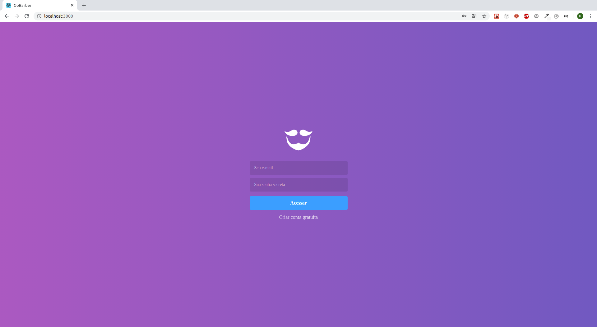
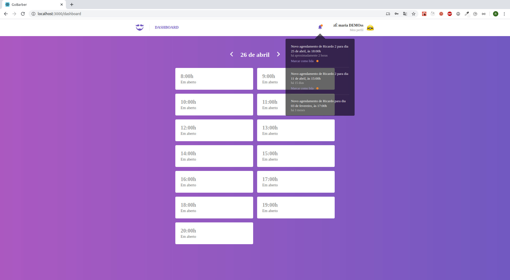
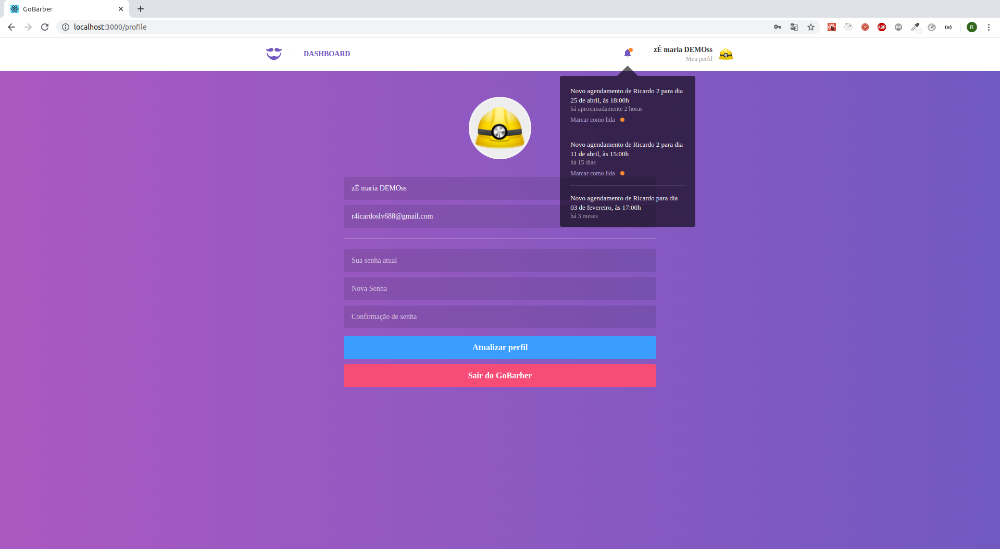
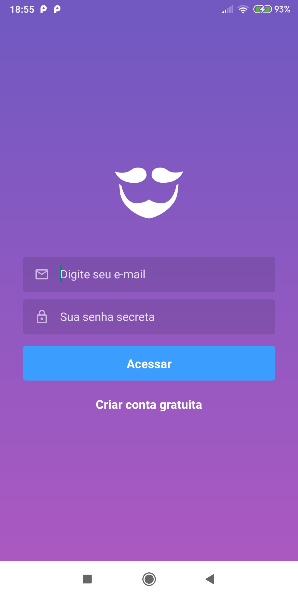
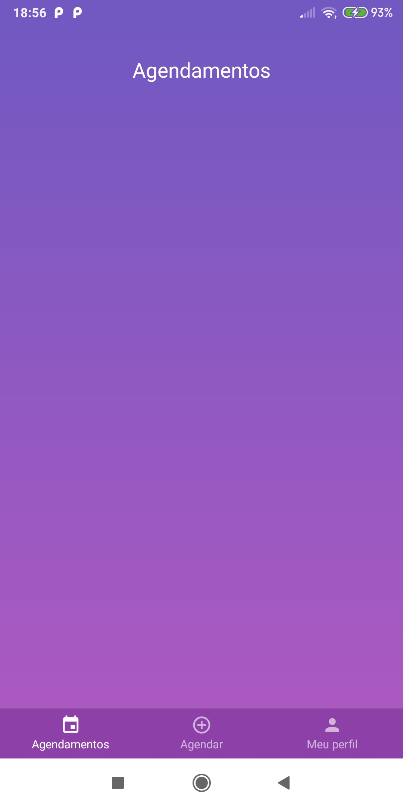
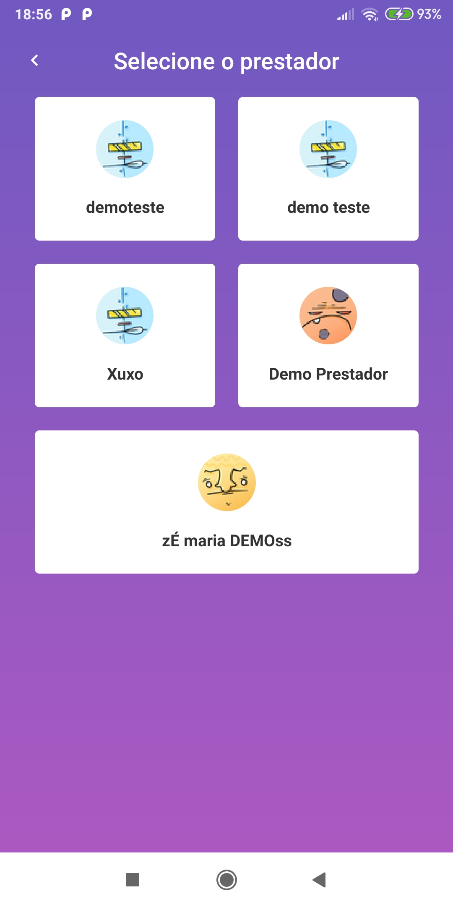
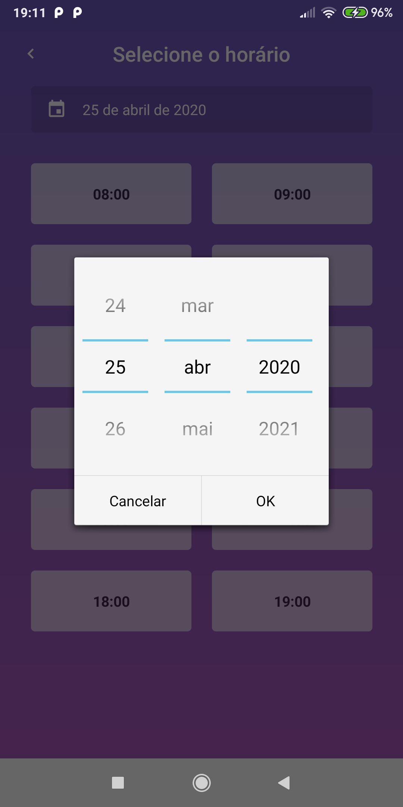
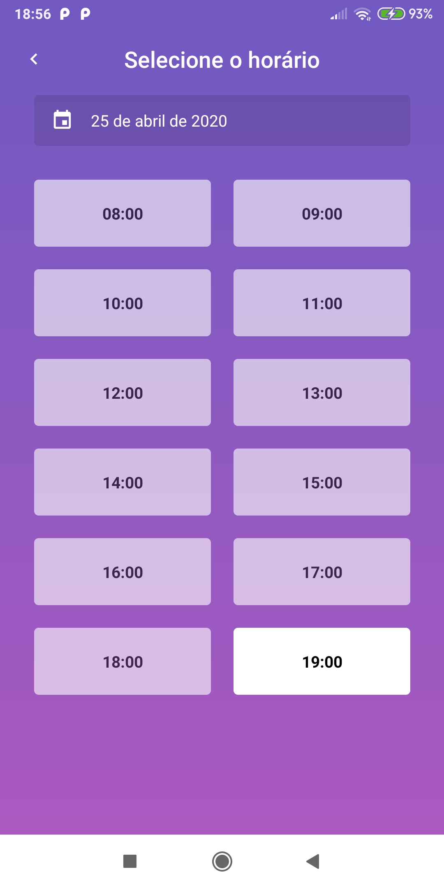

  

    

  

    <a href="#about">Sobre o desafio</a>&nbsp;&nbsp;&nbsp;|&nbsp;&nbsp;&nbsp;
    <a href="#backend">Backend</a>&nbsp;&nbsp;&nbsp;|&nbsp;&nbsp;&nbsp;
    <a href="#frontend">Frontend</a>&nbsp;&nbsp;&nbsp;|&nbsp;&nbsp;&nbsp;
    <a href="#mobile">Mobile</a>
  

 

 

 

## :rocket: Sobre o desafio

Este projeto é um serviço de criação de agendamentos de uma barbearia.

Neste projeto está contida uma aplicação completa envolvendo backend, frontend e mobile. Tudo foi construído com as tecnlologias mais populares de JavaScript.

No backend, em **Node.js**, é uma **API REST** com o intuito de distribuir os dados para as plataformas tanto **WEB** como **MOBILE**, onde também vem integrado o **Sentry** para o monitoriamento dos erros.

No frontend, em **ReactJS**, é onde o provedor de serviço pode ver os seus agendamentos marcados para os determinados dias escolhidos, num determinado horário.

No Mobile, **React Native***, é para o cliente cadastrar o horário de marcação, dentro da disponibilidade de um determinado provedor cadastrado na aplicação.

## 🧰 Ferramentas utilizadas

- :whale: **Docker** - É um software contêiner que fornece uma camada de abstração e automação para virtualização de sistema operacional

Foi utilizado o docker para a criação do banco de dados.

  Criar e startar a base de dados **POSTGRES**:

    docker run --name gobarber -e POSTGRES_PASSWORD=gobarber -p 5432:5432 -d postgres

    docker start gobarber

  Criar e startar a base de dados **REDIS**:

    docker run --name redisgobarber -p 6379:6379 -d -t redis:alpine

    docker start redisgobarber

- ⚛️ **ReactJs** - Biblioteca Javascript para criar interfaces de usuário.
- ⚛️ **React Native** - Framework para criar apps nativos usando React.
- 💅 **Styled Components** - Biblioteca Javascript pra estilizar componentes.
- 🔁 **Redux** - Biblioteca JavaScript de código aberto para gerenciar o estado do aplicativo.
- 🔂 **Redux Saga** - Biblioteca Javascript que torna os efeitos colaterais do aplicativo mais faceis de gerenciar.
- 📛 **Sentry** - Plataforma para monitoramento de erros e notificação em tempo real.
- No backend foi integrado alguns pacotes de segurança para evitar quebras na API durante a produção (rate limit, express-brute...)
- (Entre outros pacotes...)

## :package: Começando

 ``git clone https://github.com/ricardobron/GoBarber.git``

 ``cd gobarber``

## :package: Backend

1. ``cd backend``
2. ``yarn``
3. ``Criar o arquivo .env com base no .env.example``
4. ``yarn sequelize db:migrate``
5. ``yarn sequelize db:seed:all``
6. ``yarn dev``

## 💻 Frontend

1. ``cd frontend``
2. ``yarn``
3. ``yarn start``

## 📱Mobile Apenas testado em Android)

1. ``cd mobile``
2. ``yarn``
3. ``adb reverse tcp:9090 tcp:9090 (Reactotron)``
4. ``adb reverse tcp:3333 tcp:3333``
5. ``react-native start``
6. ``react-native run-android``

PS: Não inclui os commits devido à estrutura dos repos não devidamente antecipada. :grin:
